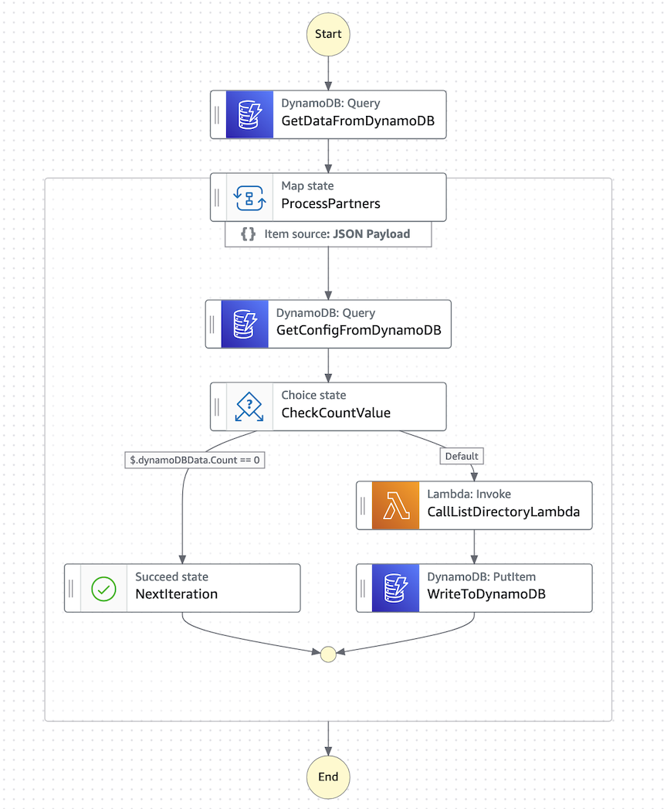
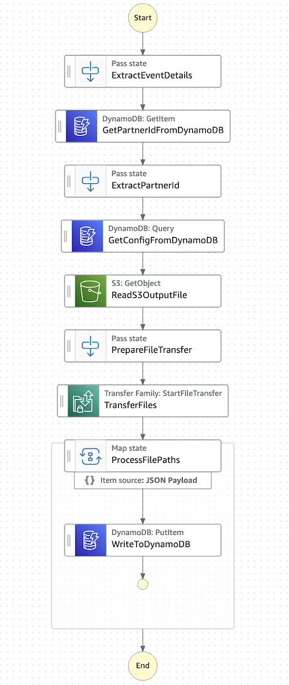
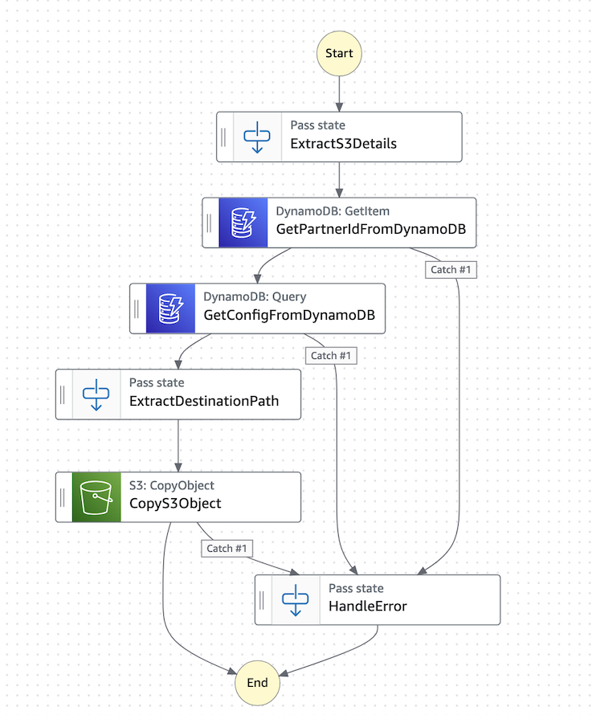

---
hide:
  - navigation
---
# Build an event-driven Managed File Transfer(MFT) workflow

## Scenario
- You are a medical insurance company.
- Your customers upload their medical claims and benefit enrollment forms to your SFTP server every day
- The medical claims are in the format of X12 document 837, and benefit enrollment in the format of X12 document 834. 
- You need to to retrieve the files at the end of day and process them
- The files need to be scanned for malware protection before they can be proessed

## Your Requirements to the solution
- Use AWS cloud native services (benefits: high availability, scalable, auditable, secure, private)
- Security, HIPAA compliant
- Privacy
- Use low code development
- Event driven and serverless
- auditable with logs
- easy to operate
- can build an operation dashboard 

## High-level solution
1. Use Amazon EventBrige Scheduler to kick off the operation every day at a fixed time.
2. Four high-level steps:
    - List the files available on the SFTP server
    - Retrive the files and deposit them to a S3 bucket
    - Malware-scan the files to make sure they are clean
    - Process the files 
3. Use AWS Step functions to coordinate each step


## Solution Walk-Through
### Create a Amazon EventBridge Scheduler
It runs every day at 6pm to kick off the first Step Function workflow, which is to list files on the SFTP server.
```bash
aws scheduler create-schedule \
  --name "DailyAt6PM" \
  --schedule-expression "cron(0 18 ? * * *)" \
  --flexible-time-window '{"Mode": "OFF"}' \
  --target '{"Arn": "STATEMACHINE_ARN", "RoleArn": "ROLE_ARN"}' \
  --region us-west-2
```

`--schedule-expression "cron(0 18 ? * * *)"`: This cron expression means "at 6:00 PM (18:00) every day". The cron format is (minute hour day-of-month month day-of-week year).

### Create a step function to list file on the customer's SFTP server
1. Create a DynamoDB table to store contexts between different work flows.
2. Create an entry to store all the customers, aka partners, that we need to process. In this case, we have two partners. 
```
    (partners, list)= [ { "S" : "partner1" }, { "S" : "partner2" } ]
```
3.  Create the step function with the following logic



#### Steps
1. GetDataFromDynamoDB: retrieve the partner list from the DynamoDB table
2. ProcessPartners: loop through partners one by one
3. GetConfigFromDynamoDB: for each partner id, retrieve the specific configuration of the partner.  For `partner1`, the config looks like the following
    ```json
    {
      "connector-id": {
        "S": "c-0ff24dc5ec6c450d9"
      },
      "remote-directory-path": {
        "S": "."
      },
      "listing-output-directory-path": {
        "S": "b2bi-pdx/connector/listing"
      },
      "file-output-directory-path": {
        "S": "b2bi-pdx/connector/downloads/partner1"
      },
      "b2bi-input-prefix": {
        "S": "input/tp-b9acc86926a245799"
      },
      "b2bi-input-bucket": {
        "S": "b2bi-pdx"
      }
    }
    ```
    - `connector-id` refers to the AWS Transfer family SFTP connector. Its configuration includes the server's address and login credentials to access the server.
    - `remote-directory-path` is the directory on the SFTP server where files are stored.
    - `listing-output-directory-path` is the AWS S3 bucket and prefix where the directory-listing output JSON file will be stored. 

    These are the information we need for us to call the AWS Transfer family SFTP connector.

4. CheckCountValue: error check to make sure there is a valid config for this partner
5. CallListDirectoryLambda: This lambda simply calls `start_directory_listing` API of the Transfer family SFTP connector. In the near future, we expect that Step Functins can invoke this API directly without a need for a Lambda function. This call is asynchronous. It returns a listing_id. 
6. WriteToDynamoDB: write the listing_id to DDB, with the value being the parter ID. This way we can look up the context
   in downstream processing. 

### Create a step function to retrieve files



This function is triggered by the AWS Transfer family listing directory completed event. Inside the event, you can find the `listing-id`. 

#### Steps
1. GetPartnerIdFromDynamoDB: using the listing-id as key to retrieve the partner-id we stored in the last step function. 
2. GetConfigFromDynamoDB: using the partner-id as key to retrieve the partner configuration
3. Read the content of the listing directory result from S3. The S3 bucket and prefix are in the listing-directory-completed event. 
4. Directly invoke the Transfer family StartFileTransfer API using the SFTP connector to retrieve the files. The API
   allows up to 10 files to be retrieve each call. 
5. Write each file's S3 path to DDB. The S3 path is the key to the DDB. The value is the partner ID. This allows for the
   next step processing to retrieve context.

### Create an Event Bridge Rule to listen on the AWS Transfer family listing directory completed event. 
The target of the event is the above step function that retrieve files. 

### Setup AWS GuardDuty S3 protection for the S3 bucket/prefix.
1. For every new file created in that S3 bucket/prefix, the AWS GuardDuty service will scan the file for malware. 
2. When scan is finished, it will post an event to the AWS Event Bridge with scanning result

### Create a step function to copy files



This function is triggered by the AWS GuardDuty scan finished event. Inside the event, you can find the s3 bucket name
and file object key. The goal of this workflow is to copy the clean files to a downstream s3 bucket for futher
processing.

#### Steps
1. GetPartnerIdFromDynamoDB: using the s3 bucket and object name as key to retrieve the partner-id we stored in the last step function. 
2. GetConfigFromDynamoDB: using the partner-id as key to retrieve the partner configuration
3. CopyS3Object: copy the clean s3 object (file) to the B2B Data Interchange incoming S3 location to kick off the B2Bi processing.

### Create an Event Bridge Rule to listen on the AWS GuardDuty scan finished event
The rule listens on events with the status of `no threats found` and trigger the above copy-files workflow.
Optinally, another rule can be created to listen on the `threat found` events and notify customers.

### Create the B2Bi resources to process the X12 files
