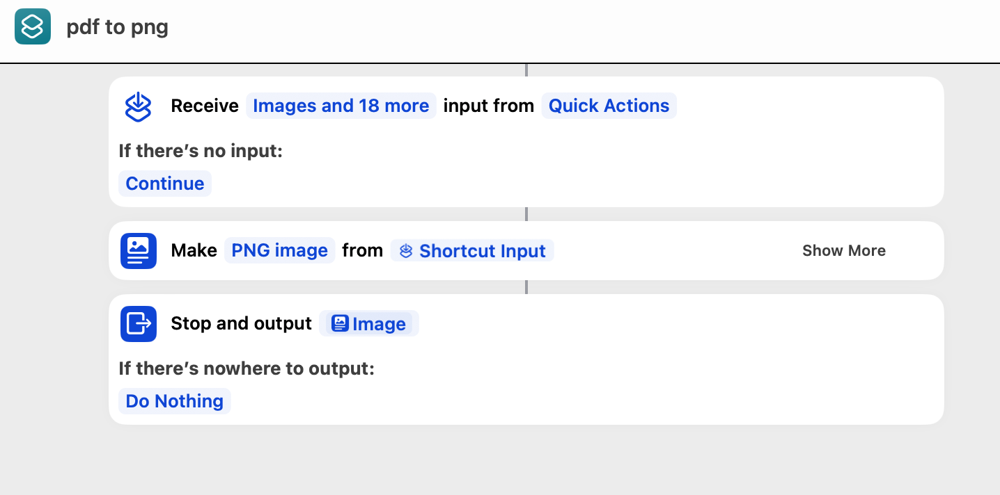
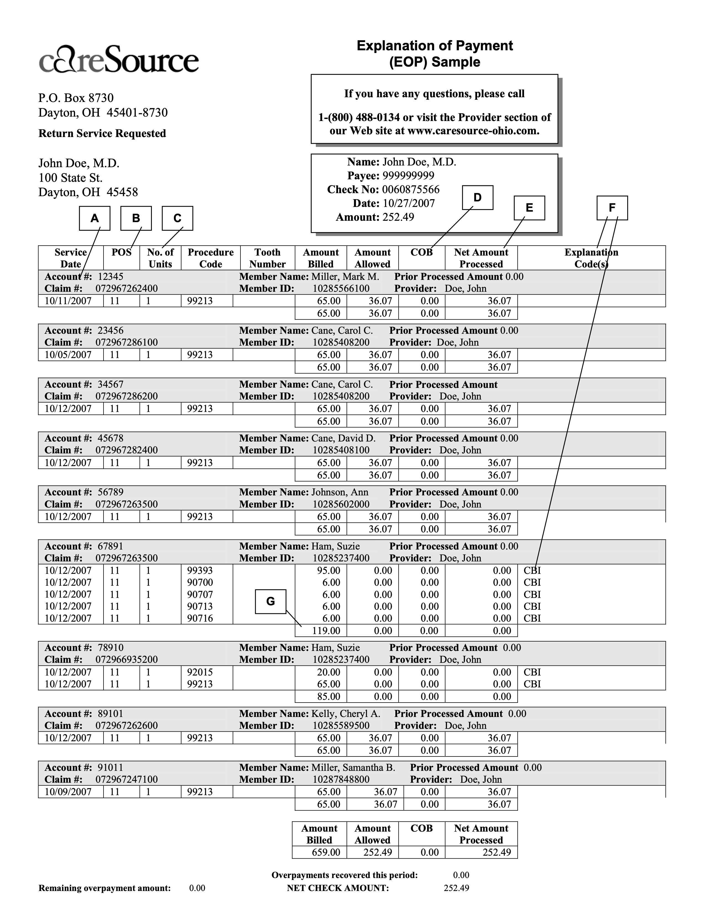

---
hide:
  - navigation
  - toc
---

# Automating the Generation of X12 835 EDI Documents from EOP PDFs

**Disclaimer**: This tutorial is for educational purposes only. Before using any real-world files, please consult your internal security team to ensure that no sensitive information, such as Personally Identifiable Information (PII), is mishandled.

Note: The files used in this example are all sample files with made-up data.

## Use Case Description

The customer is a medical service provider (e.g., doctors, hospitals, urgent care facilities) who provides medical services and bills insurance companies for those services. After processing the billing, the insurance company sends an Explanation of Payment (EOP) PDF document detailing the processing of the billing, including the billed amount, adjustments made, and the actual payment amount for each claim. Currently, the customer has to manually read the EOP PDF, extract the relevant information, and enter it into an internal billing reconciliation system.

The goal is to create an automated process that takes the EOP PDF document, extracts the information into a JSON file, and then uses the AWS B2B Data Interchange (B2BI) service to transform the JSON file into an X12 HIPAA-compliant 835 document, which can be directly ingested by the internal billing system.

## Steps

1. **Get the Example EOP PDF Document**

   The example EOP PDF document used in this tutorial is named `csexplanationofpayment.pdf`.

2. **Export Each PDF Page to a PNG File**

   On macOS, you can create a "Shortcut" inside the `Shortcuts` app to convert a PDF file to PNG files. Right-click on the PDF file in Finder, go to the `Quick Actions` menu, and click on `pdf to png`. This will generate PNG files for each page of the PDF in the same folder as the original PDF file.

   Here's a screenshot showing how to create the `pdf to png` shortcut:

   

   Here is the first page of the example EOP.

   

3. **Extract Information into JSON Using AWS Bedrock**

   a. Go to the AWS Console and select Amazon Bedrock.

   b. On the left sidebar, choose `Playgrounds -> Chat`.

   c. Select the "Claude 3.5 Sonnect" model.

   d. Upload the PNG files (maximum of 5 files, 4.5 MB each).

   e. Enter the following text instruction:

      ```
      This is an explanation of benefits from an insurance company. 
      Extract all the information out in JSON format. 
      Include the Name, Payee, Check No, Date, and Amount at the beginning of the JSON before the claims array.
      ```

   f. The Bedrock model will output a JSON array. You can refine the prompt to ensure the JSON schema matches your requirements.

   g. Save the JSON file from Bedrock into an S3 bucket.

   For this exercise, please use the following JSON content:

```json
{
  "Name": "John Doe, M.D.",
  "Payee": "999999999",
  "CheckNo": "0060875566",
  "Date": "10/27/2007",
  "Amount": 252.49,
  "claims": [
    {
      "AccountNumber": "12345",
      "ClaimNumber": "072967262400",
      "ServiceDate": "10/11/2007",
      "ProcedureCode": "99213",
      "MemberName": "Miller, Mark M.",
      "MemberID": "10285566100",
      "AmountBilled": 65.00,
      "AmountAllowed": 36.07,
      "NetAmountProcessed": 36.07
    },
    {
      "AccountNumber": "23456",
      "ClaimNumber": "072967286100",
      "ServiceDate": "10/05/2007",
      "ProcedureCode": "99213",
      "MemberName": "Cane, Carol C.",
      "MemberID": "10285408200",
      "AmountBilled": 65.00,
      "AmountAllowed": 36.07,
      "NetAmountProcessed": 36.07
    },
    {
      "AccountNumber": "34567",
      "ClaimNumber": "072967286200",
      "ServiceDate": "10/12/2007",
      "ProcedureCode": "99213",
      "MemberName": "Cane, Carol C.",
      "MemberID": "10285408200",
      "AmountBilled": 65.00,
      "AmountAllowed": 36.07,
      "NetAmountProcessed": 36.07
    },
    {
      "AccountNumber": "45678",
      "ClaimNumber": "072967282400",
      "ServiceDate": "10/12/2007",
      "ProcedureCode": "99213",
      "MemberName": "Cane, David D.",
      "MemberID": "10285408100",
      "AmountBilled": 65.00,
      "AmountAllowed": 36.07,
      "NetAmountProcessed": 36.07
    },
    {
      "AccountNumber": "56789",
      "ClaimNumber": "072967263500",
      "ServiceDate": "10/12/2007",
      "ProcedureCode": "99213",
      "MemberName": "Johnson, Ann",
      "MemberID": "10285602000",
      "AmountBilled": 65.00,
      "AmountAllowed": 36.07,
      "NetAmountProcessed": 36.07
    },
    {
      "AccountNumber": "67891",
      "ClaimNumber": "072967263500",
      "ServiceDate": "10/12/2007",
      "ProcedureCodes": ["99393", "90700", "90707", "90713", "90716"],
      "MemberName": "Ham, Suzie",
      "MemberID": "10285237400",
      "AmountBilled": 119.00,
      "AmountAllowed": 0.00,
      "NetAmountProcessed": 0.00
    },
    {
      "AccountNumber": "78910",
      "ClaimNumber": "072966935200",
      "ServiceDate": "10/12/2007",
      "ProcedureCodes": ["92015", "99213"],
      "MemberName": "Ham, Suzie",
      "MemberID": "10285237400",
      "AmountBilled": 85.00,
      "AmountAllowed": 0.00,
      "NetAmountProcessed": 0.00
    },
    {
      "AccountNumber": "89101",
      "ClaimNumber": "072967262600",
      "ServiceDate": "10/12/2007",
      "ProcedureCode": "99213",
      "MemberName": "Kelly, Cheryl A.",
      "MemberID": "10285589500",
      "AmountBilled": 65.00,
      "AmountAllowed": 36.07,
      "NetAmountProcessed": 36.07
    },
    {
      "AccountNumber": "91011",
      "ClaimNumber": "072967247100",
      "ServiceDate": "10/09/2007",
      "ProcedureCode": "99213",
      "MemberName": "Miller, Samantha B.",
      "MemberID": "10287848800",
      "AmountBilled": 65.00,
      "AmountAllowed": 36.07,
      "NetAmountProcessed": 36.07
    }
  ],
  "TotalAmountBilled": 659.00,
  "TotalAmountAllowed": 252.49,
  "TotalNetAmountProcessed": 252.49
}
```

4. **Obtain a Sample EDI 835 File**

   a. Locate a PDF document from the same insurance company that details the X12 835 EDI format with examples. In this tutorial, the PDF file is named `caresource-835-edi.pdf`.  I extracted the 835 example from the PDF and save it as `835-example.x12`.

   b. Copy the `835-example.x12` file to your S3 bucket.

5. **Create a Transformer in AWS B2B Data Interchange (B2BI)**

   a. Go to the AWS B2B Data Interchange (B2BI) service.

   b. If you don't have a profile, create one first.

   c. Create a transformer with the following settings:
      - Direction: "Outbound EDI"
      - Data Format: "JSON"
      - Version: "5010 HIPAA"
      - EDI Document Number: "835_X221"

   d. For the input sample document, point to the JSON file in your S3 bucket.

   e. For the output sample document, point to the `835-example.x12` file in your S3 bucket.

   f. In the next step, replace the mapping code with the following:


```
{
  "interchanges" : [ {
    "ISA_01_AuthorizationQualifier" : "00",
    "ISA_02_AuthorizationInformation" : "          ",
    "ISA_03_SecurityQualifier" : "00",
    "ISA_04_SecurityInformation" : "          ",
    "ISA_05_SenderQualifier" : "ZZ",
    "ISA_06_SenderId" : "SUBMITTERS ID  ",
    "ISA_07_ReceiverQualifier" : "ZZ",
    "ISA_08_ReceiverId" : "RECEIVERS ID   ",
    "ISA_09_Date" : "200101",
    "ISA_10_Time" : "1253",
    "ISA_11_RepetitionSeparator" : "^",
    "ISA_12_Version" : "00501",
    "ISA_13_InterchangeControlNumber" : "000000905",
    "ISA_14_AcknowledgmentRequested" : "0",
    "ISA_15_TestIndicator" : "T",
    "functional_groups" : [ {
      "GS_01_FunctionalIdentifierCode" : "HP",
      "GS_02_ApplicationSenderCode" : "SENDER CODE",
      "GS_03_ApplicationReceiverCode" : "RECEIVER CODE",
      "GS_04_Date" : "20200101",
      "GS_05_Time" : "0802",
      "GS_06_GroupControlNumber" : "1",
      "GS_07_ResponsibleAgencyCode" : "X",
      "GS_08_Version" : "005010X221A1",
      "transactions" : [ {
        "ST_01_TransactionSetIdentifierCode" : "835",
        "ST_02_TransactionSetControlNumber" : "1234",
        "segments" : [ {
          "BPR_01" : "C",
          "BPR_02" : $string(TotalNetAmountProcessed),
          "BPR_03" : "C",
          "BPR_04" : "CHK",
          "BPR_05" : "CTX",
          "BPR_06" : "01",
          "BPR_07" : "999999901",
          "BPR_08" : "DA",
          "BPR_09" : "999999902",
          "BPR_10" : "9999999031",
          "BPR_12" : "01",
          "BPR_13" : "999988880",
          "BPR_14" : "DA",
          "BPR_15" : "98765",
          "BPR_16" : $now('[Y0001][M01][D01]') /* date of check */
        }, {
          "TRN_01" : "1",
          "TRN_02" : $.CheckNo, /* check number */
          "TRN_03" : "1512345678"
        }, {
          "DTM_01" : "405",
          "DTM_02" : $substring($.Date, 6) & $substring($.Date, 0,2) & $substring($.Date, 3,2) /* transaction date/time */
        }, {
          "N1-1000A_loop" : [ {
            "N1_01" : "PR",
            "N1_02" : "CareSource Ohio"
          }, {
            "N3_01" : "One South Main St"
          }, {
            "N4_01" : "Dayton",
            "N4_02" : "OH",
            "N4_03" : "45402"
          }, {
            "REF_01" : "2U",
            "REF_02" : "31114"
          } ]
        }, {
          "N1-1000B_loop" : [ {
            "N1_01" : "PE",
            "N1_02" : $.Name, /* payee name */
            "N1_03" : "XX", /* type  */
            "N1_04" : $.Payee /* ID */
          }, {
            "N3_01" : "540 E Main St"
          }, {
            "N4_01" : "Canfield",
            "N4_02" : "OH",
            "N4_03" : "44406"
          } ]
        }, 

        $.claims#$index.{
          "LX-2000_loop" : [ {
            "LX_01" : $string(110000+$index*2)
          }, {
            "CLP-2100_loop" : [ {
              "CLP_01" : AccountNumber, /* patient control number */
              "CLP_02" : "1",
              "CLP_03" : $string(AmountBilled), /* charge amount requested */
              "CLP_04" : $string(AmountAllowed), /* claim aount paid */
              "CLP_06" : "MA",
              "CLP_07" : "1999999444444"
            },{
              "NM1_01" : "QC",
              "NM1_02" : "1",
              "NM1_03" : $substringBefore(MemberName,","), /* lastname */
              "NM1_04" : $trim($substringAfter(MemberName,",")),/* firstname */
              "NM1_05" : "", /* middlename */
              "NM1_08" : "HN",
              "NM1_09" : MemberID /* patient id */
            } ]
          } ]
        }
        ] /* end of segments */
      } ] /* end of transactions */
    } ]
  } ]
}
```

   g. Scroll down and click on "Generate EDI output preview". You should see the generated X12 document on the left panel.

   h. Scroll further down to the `EDI output preview errors` section for EDI validation errors, and change the mapping code to fix them.

   Here is the EDI file you should see
```
ISA*00*          *00*          *ZZ*SUBMITTERS ID  *ZZ*RECEIVERS ID   *200101*1253*^*00501*000000905*0*T*|~
GS*HP*SENDER CODE*RECEIVER CODE*20200101*0802*1*X*005010X221A1~
ST*835*1234~
BPR*C*XX-amount*C*CHK*CTX*01*999999901*DA*999999902*999999903**01*999988880*DA*98765*20240920~
TRN*1*0060875566*1512345678~
DTM*405*20071027~
N1*PR*CareSource Ohio~
N3*One South Main St~
N4*Dayton*OH*45402~
REF*2U*31114~
N1*PE*John Doe, M.D.*XX*999999999~
N3*540 E Main St~
N4*Canfield*OH*44406~
LX*110000~
CLP*12345*1*65*36.07**MA*1999999444444~
NM1*QC*1*Miller*Mark M.****HN*10285566100~
LX*110002~
CLP*23456*1*65*36.07**MA*1999999444444~
NM1*QC*1*Cane*Carol C.****HN*10285408200~
LX*110004~
CLP*34567*1*65*36.07**MA*1999999444444~
NM1*QC*1*Cane*Carol C.****HN*10285408200~
LX*110006~
CLP*45678*1*65*36.07**MA*1999999444444~
NM1*QC*1*Cane*David D.****HN*10285408100~
LX*110008~
CLP*56789*1*65*36.07**MA*1999999444444~
NM1*QC*1*Johnson*Ann****HN*10285602000~
LX*110010~
CLP*67891*1*119*0**MA*1999999444444~
NM1*QC*1*Ham*Suzie****HN*10285237400~
LX*110012~
CLP*78910*1*85*0**MA*1999999444444~
NM1*QC*1*Ham*Suzie****HN*10285237400~
LX*110014~
CLP*89101*1*65*36.07**MA*1999999444444~
NM1*QC*1*Kelly*Cheryl A.****HN*10285589500~
LX*110016~
CLP*91011*1*65*36.07**MA*1999999444444~
NM1*QC*1*Miller*Samantha B.****HN*10287848800~
SE*39*1234~
GE*1*1~
IEA*1*000000905~
```

   i. Click "Next" and then "Save" to save your transformer.

6. **Use the Transformer in a Trading Capability**

   You can now use this transformer in a "Trading Capability" where you can set up an incoming S3 bucket for the JSON files and an output S3 bucket (or prefix) for the generated EDI files. Whenever you drop a JSON file in the incoming S3 bucket, the B2BI service will perform the transformation and deposit the corresponding EDI file in your output S3 bucket.

By following these steps, you will have created an automated process to generate X12 835 EDI documents from EOP PDFs using the AWS B2BI service.
